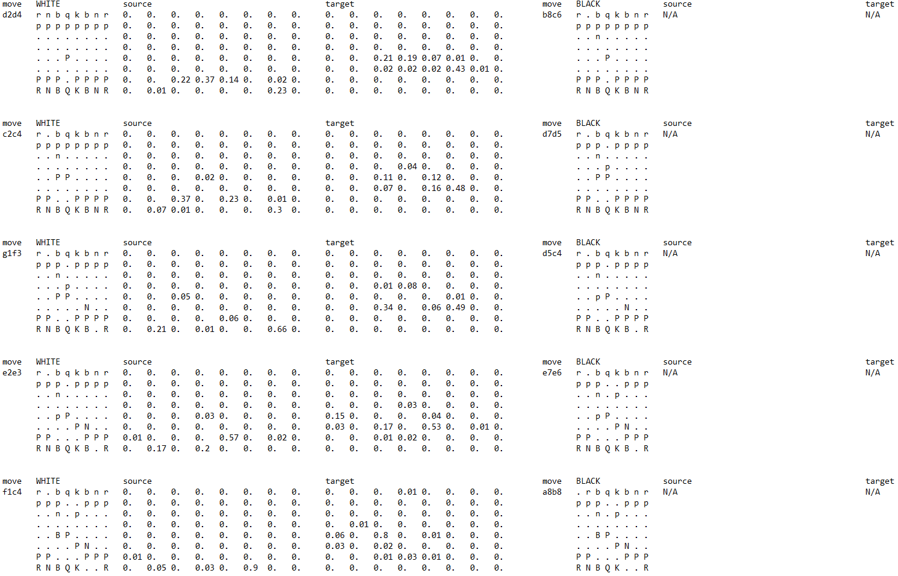

# ChessAI

## Summary

ChessAI is a project that aims to explore the viability of developing an agent of sufficient caliber in computer chess, under the constraints of limited compute resources. Unlike the popular [AlphaZero](https://arxiv.org/pdf/1712.01815.pdf) by Google DeepMind, many researchers are not blessed with extensive computing systems that can perform extensive sampling and model optimizations. Instead, our team focuses on maximizing the performance with minimal compute resources and time. The complete implementation took 4 weeks by three part-time contributors.

------

## Features

### Data Processing

This is a basic data processing feature offered (in `parsing`) which reads a series of chess games in PGN format. The games are converted into tuples of states, source action, target action and value. The board states of each game are sampled sparsely, with a default of 0.1 probability of each tuple being sampled.

### Policy Network

The primary feature of this project is the ability to develop a multi-head convolutional neural network that takes in a board tensor and returns the source action, target action and value. The architecture of the `PolicyModel` is inspired by [ResNet](https://arxiv.org/pdf/1512.03385.pdf) which contains shortcut connections.

### Monte-Carlo Tree Search

To incorporate an aspect of model-based reinforcement learning, we offer the Monte-Carlo Tree Search functionality as a data generation tool. By exploration and exploitation from simulations, it develops an approximate understanding of chess through self-play and guidance from evaluation function by [Stockfish](https://stockfishchess.org/).

### Interactive Play

A useful tool to assess the actual performance of the policy network is developed as a command line interface. The AI can be configured to challenge a human, Stockfish or even itself.

------

## Requirements

The implementation of this project is entired in Python 3.6. The requirements are:
* numpy >= 1.16.4
* scipy >= 1.3.1
* tensorflow >= 2.0.0
* python-chess == 0.31.4
* anytree >= 2.8.0
* graphviz == 0.14
* tqdm >= 4.46.0

------

## Example Execution

Suppose all executions are done at the root of the project.

### Data Extraction

To extract data from a PGN file, you have to put it in `data` directory.
```python
from parsing.data_generation import generate_dataset
PATH_TO_DATA = 'data/sample_data.pgn'

states, labels, sources, targets = generate_data(PATH_TO_DATA, LIMIT=5)
```

### Model Training

Assuming there is data already loaded as variables from the previous step, you can use them to train a `PolicyModel` which encapsulates a Tensorflow Model object.
```python
import numpy as np
from model.policy_model import PolicyModel

policy = PolicyModel(state.shape[1:], (64, 1))
policy.construct(10, 4)  # number of residual and "sandwich" blocks
policy.train(x=states, y=[sources.reshape(-1, 64),
					    targets.reshape(-1, 64),
					    labels],
			 epochs=1,
			 batch_size=512)
```

### Monte-Carlo Tree Search Data Generation

To generate data from self-play, you will need to download a Stockfish [executable file](https://stockfishchess.org/download/) and place it as `engine/stockfish.exe`. Assuming that a `PolicyModel` is already trained,
```python
from mcts import MCTS
mcts = MCTS(policy)
states, sources, targets, labels = mcts.generate_checkmate_data(PATH_TO_DATA, 30, LIMIT=10)
```

### Interactive Game with AI

Assuming that you have a trained `PolicyModel`,
```python
from play.play_loop import PlayLoop
pl = PlayLoop(policy)
pl.init_game('w')  # sets which side you want to play as
p1.loop(verbose=True)

trace = pl.get_trace()  # move history
```

After completing a game on command line, you can save `trace` to a text file. This is a sample output of the `trace`.


In the sample game, it is a match between the trained agent playing as White and a human playing as Black. The first four columns pertain to the White player and the last four columns pertain to the Black player. The source and target columns show the probabilities of the trained agent taking those actions.

------

## Implementation Standards

### Game Data

* The raw data is in PGN format 
* Upper case symbols refers to white pieces and lower case symbols refer to black pieces
* The game state for machine learning (called `Tensor`) will be a `np.ndarray` with shape `(8,8,13)` (tentatively).
* For supervised network, if the labels `y = 1` means that white wins and `y = 0` means black wins. Otherwise, `y = 0.5` means a draw.
* Labels for whether the state leads to win or lose result will be stored as a CSV file (use Pandas to read and write; learn more [here](https://www.learnpython.org/en/Pandas_Basics))
* `Tensor` will be stored in disks as Joblib files (see [here](https://joblib.readthedocs.io/en/latest/persistence.html#a-simple-example))  

### Randomization

* For all PRNG calls, set the random seed to `np.random.seed(486)`
* If you want to try different randomizations but want reproducibility, then `seed = np.random.randint(LOWER,UPPER)` and `np.random.seed(seed)` then save the `seed` somewhere if needed

### Multi-dimensional Array Indexing

* Ignoring the third dimension (piece identification), the board is a 2D array. For simplicity, suppose the board is 4x4 board. We set up arrays and index as follows:

```python
#  board = [[a,b,c,d],
#           [e,f,g,h],
#           [i,j,k,l],
#           [m,n,o,p]]

assert b == board[0, 1] == 'QUEN_B'
assert o == board[3, 2] == 'KING_W'
```

### Policy Model

* The policy model always takes the perspective of the white player so flipping `Tensor` may be necessary
* The output of the model is `source`, `target` and `value`, with shapes `(:, 64)`, `(:, 64)` and `(:, 1)` respectively. To get the original format of `source`/`target`, simply reshape it to `shape=(8,8)`.

